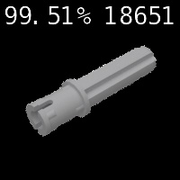

# Lego Identifier

This program takes in an image of a lego piece, and outputs the name and number of the lego piece. The program can identify 16 common lego pieces with over 90% accuracy.

\

Here are all of the pieces the model can recognize:

## Algorithm

The program uses a pretrained resnet-18 model that is trained with transfer learning on a new dataset consisting of legos. The program takes in an input image, which is then processed using Imagenet from the Jetson Inference library. Imagenet is a resnet-18 model trained on the <a href="https://www.image-net.org/challenges/LSVRC/">ILSVRC</a>, a large dataset of 1000 objects. The program processes the image and outputs a guess on what type of lego the input image is.

## Running the Project

You will need: Jetson Nano

1. Install the <a href="https://github.com/dusty-nv/jetson-inference">Jetson Inference library</a> onto your Nano. The library also comes with torch, imagenet, and a resnet-18 model, dependencies the project will be using.
2. SSH into the Nano.
3. Clone the project repository onto the Nano using the command `git clone https://github.com/Shadowf6/lego-identifier`.
4. Pick a random number between 1 and 40 and type the command `FILE=[num].png` (or upload your own image onto the nano and add the file name).
5. Run the command `python3 lego-identifier/run.py lego-identifier/test/$FILE`.

## Demonstration Video
https://drive.google.com/file/d/17xI9XmXJd8ruQQuoiYAPPo2NY0Ur3p18/view?usp=sharing
